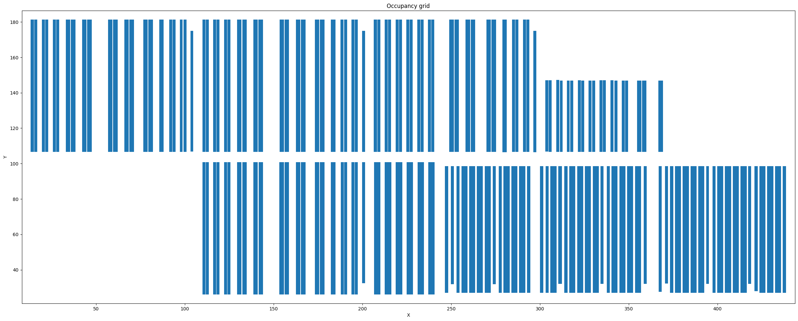
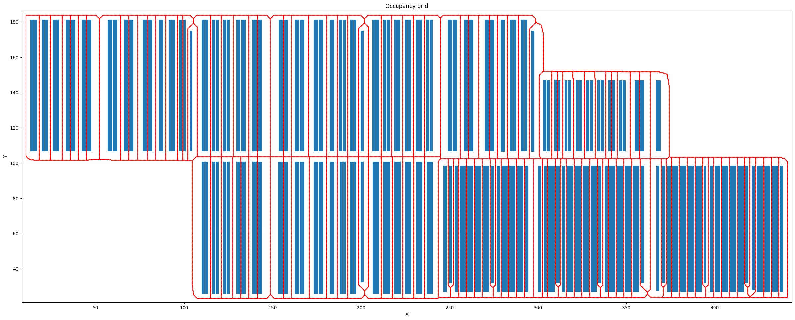

# Technical Roadmap

Addressing the Geometry Aware Mapping and Improved Path Planning TO-DOs.

## 1. Geometry Aware Mapping

### 1.1 Objective

Establish a deterministic, maintainable spatial  and geometrically aware spatial representation of the warehouse.

### 1.2 Roadmap

#### Phase A: a 2.5D representation

* Treat warehouse spatial modeling as a 2.5D problem:

  * Core navigation is 2D (e.g. we assume warehouse is a single plane that can be navigated upon).
  * `z` state is handled independantly, e.g. navigate in 2D then adjust height.
* Generate a 2D occupancy grid covering the full warehouse footprint (in reality this is an numpy array...).
* Grid cell resolution of approximately 0.5 by 0.5 meters to balance precision and computational cost.

#### Phase B: Occupancy grid construction

* Populate the occupancy grid using rack bounds (e.g. as derived from `WarehouseLocationModel` object) and any other information (e.g. restricted areas)
* Grid values represent obstacle (1) and free space states (0). (*Note this can also be probabalistic e.g. 0.75 means 75% likely to be an obstacle, not relevant for now*).
* Merge rackfaces backing onto each other (taking acount for "front" direction).
* Occupancy grid can be updated if new obstacles are percieved by the robots.

See below, for example based on demo data. Blue is obstacle, white is free-space.

#### Phase C: Travel corridor extraction

* Apply standard robotics skeletonization methods to the free-space region of the occupancy grid. Examples: medial axis transform, thinning algorithms from digital image processing.
* Produce a minimal corridor network that preserves reachability to every rack face and key operational region.
* This corridor network becomes a 2D intermediate navigation graph.
* Include physical clearance of the robot (e.g. a 1m diameter...)
* *Important here to check for / deal with unconnected subgraphs.*
* *This step can also have human input if needed, e.g. from warehouse manager?*

See below for example of free-space skeletonization using image processing (`skimage.morphology.skeletonize`)

#### Phase D: Traversibility Graph Generation

* Convert the extracted corridor cells into graph nodes. A new model definition (similar to `WarehouseLocationModel`) should be introduced (e.g. `CorridorWaypointLocationModel`) to store the spatial information about these corridor nodes. Typing would need to be updated to allow graphs to be build from both of these models.
* Build edges between nodes in 4 or 8 connectivity (e.g. city block movement or full 2D movement), depending on required precision.
* *Important to benchmark scalability here in relation to occupancy grid resolution and warehouse size.*

#### Phase E: Integration with Warehouse Locations

* For every warehouse location (e.g. as defined by `WarehouseLocationModel`), compute the nearest reachable corridor node.
* Create connector edges from the location to the corridor network.
* Resulting graph unifies `warehouse_location` -> 2D intermediate navigation graph ->  `warehouse_location`.

#### Phase F: Dynamic Updating

* Allow occupancy grid modifications for temporary obstructions.
* Locally regenerate affected skeleton segments locally rather than recomputing the entire map.
* Update corresponding sections of the traversibility graph to maintain accurate connectivity.

## 2. Improved Path Planning

### 2.1 Objective

Fast and efficient pathfinding across the warehouse map.

### 2.2 Roadmap

#### Phase A: `A*` Integration

* Implement `A*` pathfinding, this is a straightforward extension of the existing `DijkstraPathFinder` that utilises a heuristic to prioritize searching.
* Use straight-line distance as the admissible heuristic to reduce search expansion compared to Dijkstra.
* Maintain compatibility with existing move cost interfaces.
* There are a huge amount of pathfinding algorithms beyond `A*`, but in this highly structured problem not clear that these would be required.

#### Phase B: Core pathfinding

* Compute the shortest path between source and destination in 2D using `A*`.
* Handle Z movement as a robot state transition rather than part of the global search space.
  * If the robot can travel while raised (would need to clarify), apply delta Z adjustments concurrently with horizontal movement.
  * If the robot cannot travel while raised... 
    * Lower to floor -> Perform 2D navigation -> Raise at the destination.
* *This assumption delegates fine-grained alignment and final approach to the onboard local controller and perception stack.*

#### Phase C: Special cases

* Take advantage of structured nature of warehouse.
* Implement direct-move shortcuts for cases such as transitions between positions on the same rack face.
* Ensure overrides integrate cleanly with the existing `PathFinder` interface.

#### Phase G: Caching

* Make use of caching for performance speed ups, e.g. shortest path between particular rackfaces and columns does not change over time, so incorporate this into path finding.

## General improvements

* Make use of existing python packages (while avoiding over-reliance) where appropriate e.g. [NetworkX](https://networkx.org/documentation/stable/index.html), which already has some tools for graph representation and pathfinding. 